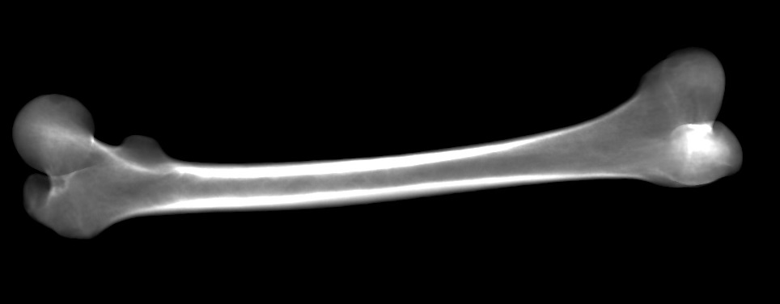

SSIM Renderer Library 
=====================
SSIM Renderer is a Qt-based C++ library for OpenGL enabled rendering
of virtual X-Ray images from statistical shape and intensity models.

Description
-----------
The main focus of the library is a rendering of virtual X-Ray images from 
a statistical shape and intensity model (SSIM) proposed by R. Yao [1]. 
The library provides OpenGL accelerated rendering of the SSIM according to [2]. 
Moreover, it includes OpenGL and OpenCL implementations of two image similarity 
metrics: joint histogram normalized mutual information metric and sum 
of squared differences metric. The library is highly optimised and suitable 
for purposes of 2D-3D deformable registration [3]. It is also capable to work 
with simple polygonal statistical shape models (SSM) stored in Statismo file 
format.

Version from 17 December 2015.
Updated on 26 January 2023.

Features
--------
 * Rendering of virtual X-Ray images from SSIM.  
 * Rendering of density images with float values from SSIM.
 * Rendering of surface images from SSIM/SSM.  
 * Rendering of silhouettes of SSIM/SSM.      
 * Mirroring of the shape models.
 * Sharing shape model between many renderers using OpenGL shared contexts.
 * Exporting the surface of the shape model in STL file format.
 * Computation of OpenGL and OpenCL accelerated image similarity metrics.
 * etc.      

Installation
-------------
The project requires following toolkits and libraries installed:

 * Qt 5 or later 
 * HDF5
 * libmeshb7 (https://github.com/LoicMarechal/libMeshb)
 * matio (https://github.com/tbeu/matio)
 * zlib
 * OpenEXR (https://github.com/afichet/openexr-viewer)
 
Envriroment variables must be set according to ssimrenderer_dependents.pri file.
    
The library has been developped for usage with Windows 7 or later.

Examples
--------
To get started with the SSIM Renderer library, please have a look 
at the included examples:

 * ImageMetrics.cpp
   - example demonstrating computation of image similarity metrics 
     between two virtual X-Ray images
 
 * SimpleStatismoModel.cpp
   - demonstration of the offscreen rendering of a simple polygonal 
     shape model

 * IntensityShapeModel.cpp
   - example of rendering virtual X-Ray images from a statistical 
     shape and intensity model
         <figure>
    
    <figcaption>Digitally reconstructed radiograph rendered from a statistical shape and intensity model.</figcaption>
</figure> 
     
 * DensityImage.cpp
   - example shows how to render a density image containing float values. The resulting image is stored in OpenEXR format. The example allows to render images in physical units.   
    <figure>
    
    <figcaption>Screen shot of a density image in the OpenEXR viewer (<https://github.com/afichet/openexr-viewer>).</figcaption>
</figure> 

There is also a full reference manual available.

Downloading
-----------
The SSIM Renderer library can be further redistributed under the terms 
of the LGPL version 3 open source license. 
The library can be obtained from the following location: 
<http://www.fit.vutbr.cz/research/prod/?id=458>

Citation 
---------------
If you use the library, please cite the following research: 

Ondrej Klima, Petr Kleparnik, Michal Spanel, and Pavel Zemcik "Intensity-based femoral atlas 2D/3D registration using Levenberg-Marquardt optimisation", Proc. SPIE 9788, Medical Imaging 2016: Biomedical Applications in Molecular, Structural, and Functional Imaging, 97880F (29 March 2016); https://doi.org/10.1117/12.2216529

<a href="https://www.spiedigitallibrary.org/conference-proceedings-of-spie/9788/97880F/Intensity-based-femoral-atlas-2D-3D-registration-using-Levenberg-Marquardt/10.1117/12.2216529.full">Article fulltext in SPIE Digital Library</a>

Acknowledgment
---------------
This work has been supported by the Technology Agency of the Czech Republic 
(TA CR, Project Id: TA04011606).

Authors
-------
 * Petr Kleparnik   (<ikleparnik@fit.vutbr.cz>)
 * Ondrej Klima     (<iklima@fit.vutbr.cz>, ORCID: 0000-0001-9295-065X, <https://www.fit.vut.cz/person/iklima/.en>, <https://www.researchgate.net/profile/Ondrej-Klima-4>)
 * Michal Spanel    (<spanel@fit.vutbr.cz>)
 * Pavel Zemcik     (<zemcik@stud.fit.vutbr.cz>)

References
----------
[1] J. Yao, R. Taylor, "Construction and simplification of bone density models"
    SPIE Medical Imaging: 2001.
    
[2] M. Ehlke, HRamm, H. Lamecker, H.C. Hege, S. Zachow. "Fast generation 
    of virtual X-ray images for reconstruction of 3D anatomy." IEEE Trans Vis 
    Comput Graph: Dec 2013.
    
[3] O. Klima, P. Kleparnik, M. Spanel, P. Zemcik, "GP-GPU accelerated 
    intensity-based 2D/3D registration pipeline" In Proceedings of Shape 
    Symposium, p. 19, Delemont, Switzerland, 2014. 
